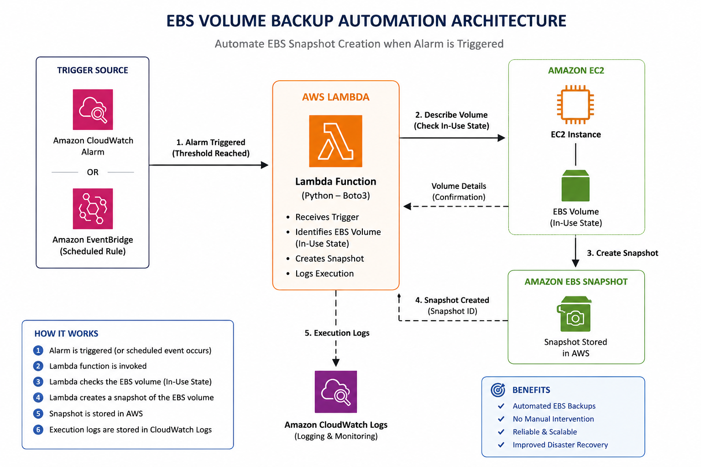
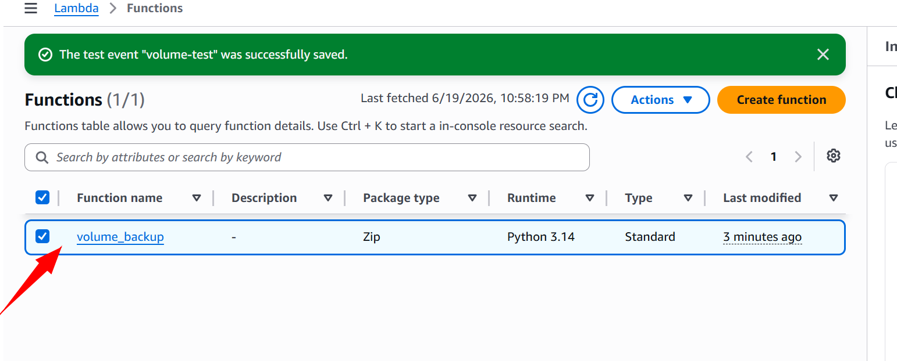
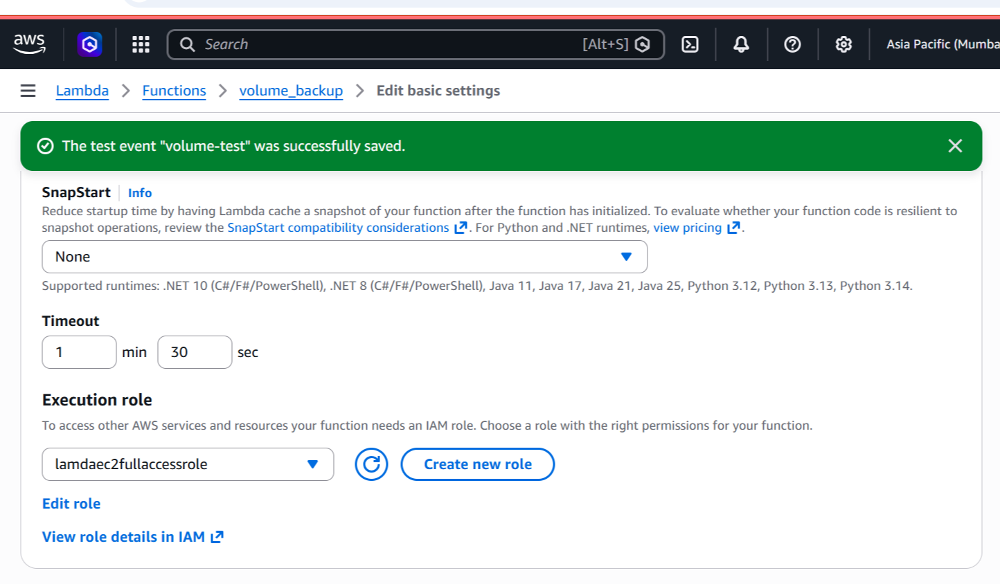
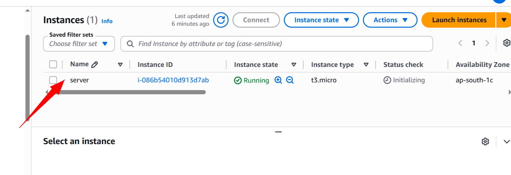
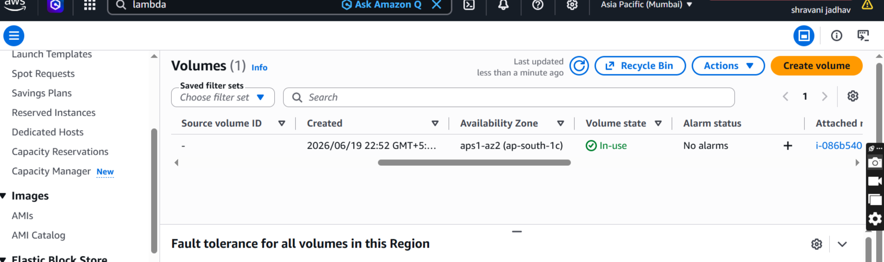
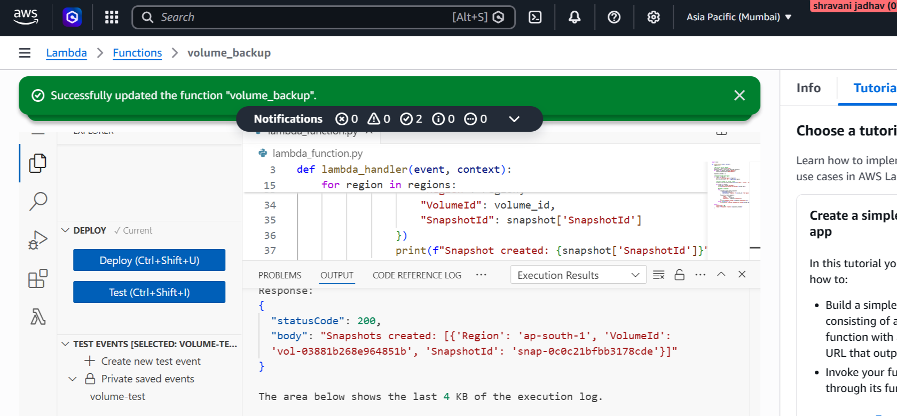
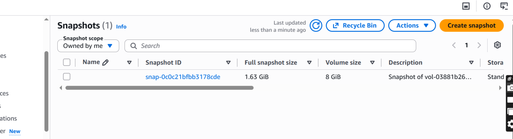

# AWS EBS Volume Backup Automation Using Lambda & Python
# INTRODUCTION
This project automates the backup process of Amazon EBS volumes using AWS Lambda and Python. Whenever the backup process is triggered, the Lambda function automatically creates a snapshot of an EBS volume that is currently in the In-Use state.<br>

The solution eliminates manual snapshot creation and helps ensure regular backups of critical storage volumes.
# Architecture Diagram

# AWS Services Used
* AWS Lambda
* Amazon EC2
* Amazon EBS
* Amazon CloudWatch
* AWS IAM
* Python (Boto3)
# Project Workflow
1.An event triggers the Lambda function.<br>
2.Lambda uses Boto3 to communicate with EC2 services.<br>
3.The function identifies the target EBS volume.<br>
4.Lambda verifies the volume is in the In-Use state.<br>
6.A snapshot of the EBS volume is created automatically.<br>
7.The snapshot is stored in AWS for backup and recovery purposes.<br>
8.CloudWatch Logs record the execution details.<br>
# Step-by-Step Implementation
## Step 1: Create an IAM Role

Attach the following permissions:

* AmazonEC2FullAccess
* AWSLambdaBasicExecutionRole
## Step 2: Create Lambda Function
* Open AWS Lambda
* Click Create Function
* Function Name:
volume-backup
* Runtime:
Python 3.12

## Step 3: Add Python Code

Deploy the Python code that creates EBS snapshots using Boto3.<br>
```bash
import boto3

def lambda_handler(event, context):
    regions = []

    # Get a list of all regions
    ec2_client = boto3.client('ec2')
    regions_response = ec2_client.describe_regions()
    for region in regions_response['Regions']:
        regions.append(region['RegionName'])

    snapshots_created = []

    # Iterate through each region
    for region in regions:
        print(f"Processing region: {region}")
        ec2 = boto3.client('ec2', region_name=region)

        # Get all volumes in 'in-use' state
        volumes = ec2.describe_volumes(Filters=[{'Name': 'status', 'Values': ['in-use']}])['Volumes']

        for volume in volumes:
            volume_id = volume['VolumeId']
            print(f"Creating snapshot for Volume: {volume_id}")

            # Create a snapshot
            try:
                snapshot = ec2.create_snapshot(
                    VolumeId=volume_id,
                    Description=f"Snapshot of {volume_id} from region {region}"
                )
                snapshots_created.append({
                    "Region": region,
                    "VolumeId": volume_id,
                    "SnapshotId": snapshot['SnapshotId']
                })
                print(f"Snapshot created: {snapshot['SnapshotId']}")
            except Exception as e:
                print(f"Error creating snapshot for volume {volume_id} in region {region}: {str(e)}")

    return {
        "statusCode": 200,
        "body": f"Snapshots created: {snapshots_created}"
    }
 ```

The code:<br>

* Connects to EC2 service

* Identifies the EBS volume

* Creates a snapshot
* Stores logs in CloudWatch
## Step 4: Configure Trigger

You can trigger the Lambda function using:<br>

* Amazon EventBridge Scheduler
* CloudWatch Alarm
* Manual Testing

For this project, the trigger initiates the snapshot creation process automatically.
## Step 5: Test the Project

Trigger the Lambda function.<br>

Expected Result:<br>

EBS Snapshot Created Successfully<br>


Verify by navigating to:<br>

EC2 → Snapshots<br>


A new snapshot should be visible.<br>
# Sample Python Logic
1. Connect to EC2 using Boto3
2. Identify EBS Volume ID
3. Create Snapshot
4. Return Snapshot ID
# Key Features
* Automated EBS Backups
* Serverless Architecture
* Reduced Manual Effort
* Improved Disaster Recovery
* Scheduled Backup Capability
* Cloud-Based Snapshot Management
# Key Learnings
* AWS Lambda Automation
* Amazon EBS Snapshot Management
* IAM Roles and Permissions
* Event-Driven Architecture
* Boto3 Integration
* CloudWatch Monitoring
* Backup and Recovery Concepts
# Project Outcome

Successfully automated the EBS backup process using AWS Lambda and Python. The solution creates snapshots of active EBS volumes automatically, reducing manual intervention and improving backup reliability.
# Future Enhancements
* Automatic Snapshot Cleanup
* Snapshot Retention Policy
* Multi-Volume Backup Support
* Email Notifications using SNS
* Cross-Region Snapshot Replication
* Automated Recovery Testing
# Author
<b> Shravani Jadhav </b>

# Special Thanks

Special thanks to my mentor <b>Trupti Ma'am</b> for her valuable guidance, support, and mentorship throughout the project.